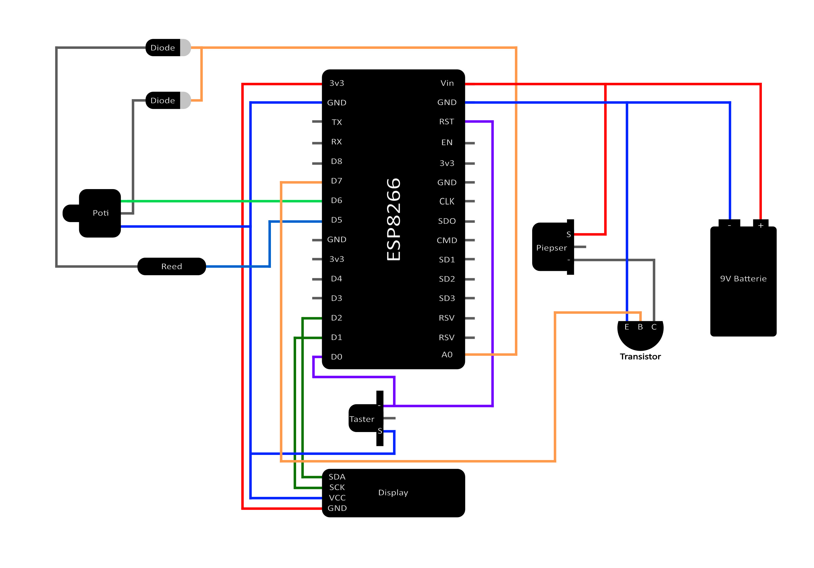

# Fenstersensor


## Inhaltsverzeichnis

- [Fenstersensor](#fenstersensor)
  - [Inhaltsverzeichnis](#inhaltsverzeichnis)
  - [Motivation](#motivation)
  - [Notwendige Hard \& Software](#notwendige-hard--software)
    - [Bauteile](#bauteile)
    - [Hardware](#hardware)
    - [Software](#software)
  - [Schaltplan](#schaltplan)
  - [Einrichten des Mikrocontrollers](#einrichten-des-mikrocontrollers)
    - [Voraussetzungen](#voraussetzungen)
    - [Treiber Installation](#treiber-installation)
    - [Herunterladen von Micropython](#herunterladen-von-micropython)
    - [Installieren des esptools und des Treibers](#installieren-des-esptools-und-des-treibers)
    - [Installation von Micropython auf dem Mikrocontroller](#installation-von-micropython-auf-dem-mikrocontroller)
  - [Flashen des Programmcodes auf den Mikrocontroller](#flashen-des-programmcodes-auf-den-mikrocontroller)
    - [Programmcode](#programmcode)
  - [Funktionsweise](#funktionsweise)
    - [Montage am Fenster](#montage-am-fenster)
    - [Standbymodus](#standbymodus)
    - [Timer stellen](#timer-stellen)

## Motivation

Der in diesem Dokument beschriebene Magnetsensor wurde im Rahmen einer Projektarbeit für die Hochschule der Medien
erstellt. Ziel war es dabei einen möglichst leichtgewichtigen Sensor zu bauen, der feststellt ob ein Fenster/Tür oder
ähnliches offen ist und nach einer zuvor festgelegten Zeit den Anwender über einen Ton darüber benachrichtigt, das
Fenster oder die Tür zu schließen.

## Notwendige Hard & Software

### Bauteile

- [ESP8266 Mikrocontroller](https://www.az-delivery.de/products/nodemcu-lolin-v3-modul-mit-esp8266)
- [OLED Display](https://www.amazon.de/dp/B07BY6QN7Q/ref=twister_B07ZT329J1?_encoding=UTF8&psc=1) (hier verwendet)
  oder [LCD Display](https://www.amazon.de/AZDelivery-HD44780-Display-Schnittstelle-Hintergrund/dp/B079T1BW6T/ref=sr_1_11?__mk_de_DE=%C3%85M%C3%85%C5%BD%C3%95%C3%91&crid=4KVPL2HHDPWY&keywords=arduino%2Breflective%2Blcd%2Bdisplay&qid=1669644099&sprefix=arduino%2Breflective%2Blcd%2Bdisplay%2Caps%2C81&sr=8-11&th=1)
- [Breadboard mit Kabeln und Netzteil](https://www.amazon.de/AZDelivery-102-Breadboard-Kit-Steckbr%C3%BCcken/dp/B07VC9ZRW1/ref=sr_1_12?keywords=breadboard&qid=1669644482&sprefix=bread%2Caps%2C129&sr=8-12&th=1)
- [Reed schalter mit Magneten](https://www.amazon.de/QUCUMER-Reedschalter-Reed-Schalter-Magnetischer-Induktionsschalter/dp/B097PK2MLT/ref=sr_1_7?__mk_de_DE=%C3%85M%C3%85%C5%BD%C3%95%C3%91&crid=2JBFT7HTXZTKI&keywords=reed+schalter&qid=1669645077&sprefix=reed+schalter%2Caps%2C105&sr=8-7)
- [Piezo buzzer zum Stecken](https://www.amazon.de/AZDelivery-KY-006-Passives-Buzzer-Arduino/dp/B07DPR4BTN/ref=sr_1_6?keywords=piezo+buzzer&qid=1669643272&sr=8-6)
  oder [Piezo buzzer zum Löten](https://www.amazon.de/ARCELI-Elektronische-Magnetic-Dauerton-Arduino/dp/B07RDHNT1P/ref=sr_1_9?keywords=piezo+buzzer&qid=1669643375&sr=8-9)
- [Potentiometer](https://www.amazon.de/Aihasd-Adjustment-Single-Linear-Potentiometer-100K/dp/B01NBBAQR0/ref=sr_1_6?__mk_de_DE=%C3%85M%C3%85%C5%BD%C3%95%C3%91&crid=2T874AOTIDJP1&keywords=potentiometer%2B100k&qid=1669642783&s=industrial&sprefix=potentiometer%2B100k%2Cindustrial%2C116&sr=1-6&th=1)
- [Taster (zum löten)](https://www.amazon.de/Youmile-100er-Pack-Miniatur-Mikro-Taster-Tastschalter-Qualit%C3%A4tsschalter-Miniature-6-x-5-mm/dp/B07Q1BXV7T/ref=sr_1_5?__mk_de_DE=%C3%85M%C3%85%C5%BD%C3%95%C3%91&crid=AGIGZAUYAMVW&keywords=arduino+taster&qid=1669642977&s=industrial&sprefix=arduino+taste%2Cindustrial%2C123&sr=1-5)
  oder [Taster (zum stecken)](https://www.amazon.de/AZDelivery-KY-004-Schalter-Schl%C3%BCsselschalter-Arduino/dp/B07DPSMRJ6/ref=sr_1_20?__mk_de_DE=%C3%85M%C3%85%C5%BD%C3%95%C3%91&crid=AGIGZAUYAMVW&keywords=arduino+taster&qid=1669643122&s=industrial&sprefix=arduino+taste%2Cindustrial%2C123&sr=1-20)
- Kabel
- 9V-Batterie
- Dioden
- Gehäuse (3D Modelle zum Drucken befinden sich im Repository)

### Hardware

- Computer mit USB-Anschluss
- Mikro-USB Kabel
- Lötkolben

### Software

- [Visual Studio Code](https://code.visualstudio.com/) (Entwicklungsumgebung)
- [Micropython](http://micropython.org/download/) (Laufzeitumgebung für den ESP8266)
- [Anaconda Distribution](https://www.anaconda.com/products/individual)
- evtl. [Treiber](https://www.silabs.com/developers/usb-to-uart-bridge-vcp-drivers?tab=downloads)

## Schaltplan

Als ersten Schritt empfehlen wir das Stecken der Verbindungen auf einem Breadboard. Dieses eignet sich besonders zum
Testen der Verkabelung vor dem Löten.
Die Verkabelung können Sie dem unten stehenden Schaubild entnehmen.



Gesteckt auf dem Breadboard:


## Einrichten des Mikrocontrollers

### Voraussetzungen

- Computer mit vorhandenem USB port und Internetverbindung
- ESP8266 Mikrocontroller
- Passendes USB Kabel (meist Micro-USB) zum Anschließen an des Mikrocontrollers an den Rechner
- Die [Anaconda Distribution](https://www.anaconda.com/products/individual) muss auf dem Rechner vorhanden sein

### Treiber Installation

USB2serial Treiber installieren  
Das Betriebssystem des Rechners, welches zum Übertragen ("flashen") des Sensors-Programms ("Firmware") auf den NodeMCU
verwendet wird, benötigt einen Treiber / ein Modul um mit dem NodeMCU kommunizieren zu können. Der Rechner kommuniziert
mit dem USB2Serial Chip, welcher auf der NodeMCU verbaut ist. Je nach Version des NodeMCU muss ein entsprechender
Treiber installiert sein. Bei Linux Betriebssystemen ist in der Regel bereits ein passender Treiber vorhanden.

Unter Windows ist der Treiber [hier](https://www.silabs.com/developers/usb-to-uart-bridge-vcp-drivers?tab=downloads) zu finden. Dieser lässt sich nach dem Herunterladen durch einfaches Ausführen installieren.

1. Laden Sie sich den zum Beispiel den _**"Windows Universal Treiber"**_ herunter.
2. Führen Sie diesen mit einem Doppelklick aus.
3. Der Treiber sollte nun installiert sein.

### Herunterladen von Micropython

1. Gehen Sie auf die Webseite von [Micropython](http://micropython.org/download/).
2. Wählen Sie das ESP8266 Modul mit der, für Ihr Modell übereinstimmenden Speichergröße aus.
3. Laden Sie sich die neueste Datei mit Dateiendung ``.bin`` herunter.

### Installieren des esptools und des Treibers

Der folgende Schritt setzt voraus dass Sie die Anaconda Distribution von Python und das Anacondaprompt als Terminal
nutzen. Beides können Sie unter folgendem [hier](https://www.anaconda.com/products/individual) herunterladen und
installieren.

1. Geben Sie im Startmenü (unter Windows einmal die Windows Taste drücken) _**"Anaconda"**_ ein
2. Öffnen sie das ``Anaconda Prompt``
3. Erzeugen Sie eine neue Virtuelle Umgebung, zum Beispiel mit dem Namen ``esp8266`` mit folgendem Befehl:

```
conda create -y -n esp8266 python=3.8
```

5. Aktivieren Sie folgendermaßen die virtuelle Umgebung:

```
 conda activate esp8266
 ```

5. Installieren Sie das  _**esptool**_:

```
python -m pip install esptool
```

### Installation von Micropython auf dem Mikrocontroller

1. Schließen Sie den Mikrocontroller mittels USB Kabel an ihren Computer an.
2. Überprüfen Sie ob der Mikrocontroller von Ihrem Computer erkannt wird:
    1. Unter Windows: öffnen Sie den Gerätemanager, z.B. durch Eingabe von _**"Geräte Manager"**_ im Startmenü.
    2. Sie sollten in der Sektion _**"Anschlüsse (COM&LPT)**_ einen ähnlichen Eintrag zu
       *_Silicon Labs CP201x USB to UART Bridge (COM4)_* finden.
    3. Merken Sie sich die _**COM**_-Nummer
    4. Sollten Sie dort den Mikrocontroller nicht finden versuchen Sie ein anderes USB-Kabel und stellen Sie sicher dass der
       SiLabs Treiber installiert ist.
3. Navigieren Sie im Anaconda Prompt mithilfe das nachfolgenden Befehls in den _**Downloads**_-Ordner ihres PCs:

```
cd Downloads
```

4. Lassen Sie sich mit dem folgenden Befehl den Inhalt des Downloads Ordners anzeigen:

```
dir
```

5. Löschen Sie den Speicher des Mikrocontrollers mit dem nachfolgenden Befehl. Ersetzen Sie dabei ``COM4`` mit der
   Nummer die Sie im Gerätemanager vorgefunden haben:

```
esptool --chip esp32 --port COM4 erase_flash
```

6. Flashen Sie die Micropython-Laufzeitumgebung auf den Mikrocontroller. Stellen Sie dabei sicher, dass die
   Laufzeitumgebung, die
   zu Beginn heruntergeladen wurde, im Downloads Ordner liegt. Achten Sie darauf dass innerhalb des Befehls der
   .bin-Dateiname der Laufzeitumgebung richtig geschrieben ist. Dazu können Sie anfangen den Dateinamen zu tippen
   und mit der [TAB]-Taste vervollständigen lassen. Ersetzen Sie auch hier wieder die ``COM``-Nummer mit der vorher im
   Dateimanager gemerkten Zahl. Ersetzen Sie auch den Eintrag ``<Laufzeitumgebung.bin>`` mit dem Namen ihrer ``.bin``
   -Datei.

```
esptool --chip esp32 --port COM4 --baud 460800 write_flash -z 0x1000 <Laufzeitumgebung.bin>
```

## Flashen des Programmcodes auf den Mikrocontroller

1. Installieren Sie Visual Studio Code (VS Code) falls nicht vorhanden.
2. Öffnen Sie in VS Code den Reiter Erweiterungen.
3. Suchen und installieren Sie die Erweiterung **_Pymakr - Preview_**.
4. Öffnen Sie links am Rand von VS Code mit einem klick auf das Symbol das aussieht wie zwei Anführungszeichen die
   PyMakr Console.
5. Stellen Sie sicher, dass der Mikrokontroller angeschlossen ist und Sie Micropython auf diesen aufgespielt haben.
6. Klicken Sie bei ihren Mikrocontroller in der angezeigten Liste auf die drei Punkte rechts und wählen _**connect**_.
7. Sie sollten nun mit dem Mikrocontroller verbunden sein.

### Programmcode

1. Wählen Sie den Ordner des Mikrocontrollers in der obigen Liste aus.
2. Legen Sie jeweils eine neue Datei mit den entsprechenden Namen und folgendem Code an:

* ``beep.py:``

```python
from machine import PWM
from time import time
from globals import STATES, read_value, BEEP_TIME_OFF, DEVELOPMENT

display = None
transition_state = None
pwm = None
start_time = 0

def init(shared:dict, transition):
    global display, transition_state, pwm, start_time
    transition_state = transition
    if (read_value(shared["reed"], shared["adc"]) > 900) != DEVELOPMENT:
        transition_state(1) # idle
        return
    display = shared["display"]
    display.fill(0)
    display.text("Buzzing", 0, 0, 1)
    display.text("Close Window!", 0, 16, 1)
    display.show()
    start_time = time()
    pwm = PWM(shared["buzz"], freq=500, duty=512)

def run(shared:dict):
    global pwm
    _reed = read_value(shared["reed"], shared["adc"])
    if (_reed > 900) != DEVELOPMENT: 
        pwm.deinit()
        transition_state(STATES["idle"])
    elif (time() - start_time) > BEEP_TIME_OFF:
        pwm.deinit()
        transition_state(STATES["off"])
`````

* ``globals.py:``

```python
DEVELOPMENT = False
IDLE_TIME_OFF = 15 if not DEVELOPMENT else 5 # Time after which the MC powers off in idle state
BEEP_TIME_OFF = 120 if not DEVELOPMENT else 1# Time after which the MC powers off in beep state
POWER_OFF_DELAY = 5 # Countdown time before power off
OFF_POTI_DELTA = 50 # The difference in measurement of the Poti to prevent shutdown
OFF_REED_DELTA = 50 # The difference in measurement of the Reed to prevent shutdown

STATES = {
    "off": 0,
    "idle": 1,
    "timer_running": 2,
    "beep": 3
}

def read_value(pin, adc) -> int:
    pin.on()
    _val = adc.read()
    pin.off()
    return _val
```

* ``idle.py:``

```python
from time import time
from globals import read_value, STATES, IDLE_TIME_OFF, DEVELOPMENT

display = None
transition_state = None
start_time = 0


def init(shared:dict, transition):
    global display, transition_state, start_time
    start_time = time()
    display = shared["display"]
    transition_state = transition
    display.fill_rect(0, 0, 128, 16, 0)
    display.text("Set time:", 0, 0, 1)
    display.show()


def run(shared:dict):
    if time() - start_time > IDLE_TIME_OFF:
        transition_state(STATES["off"])
        return

    # read poti and reed
    _poti = read_value(shared["poti"], shared["adc"]) # max value = 950
    _reed = read_value(shared["reed"], shared["adc"])
    print(_poti, _reed)
    
    display.fill_rect(0, 16, 128, 32, 0)
    display.text(f"Timer: {_poti//60 :02}:{_poti%60 :02}", 0, 16, 1)
    display.show()

    if (_reed < 900) != DEVELOPMENT:
        shared["temp"] = (time(), _poti) # time since reset in seconds
        transition_state(STATES["timer_running"])
```

* ``main.py:``

```python
import off
import idle
import timer_running
import beep
from globals import STATES

from machine import Pin, I2C, ADC
import ssd1306
import time

i2c = None
display = None
adc = None
poti = None
reed = None
buzz = None
shared_data = None
current_state = 0


def init():
    global i2c, display, adc, poti, reed, buzz, shared_data, current_state 
    print(__name__)
    # startup
    i2c = I2C(scl=Pin(5), sda=Pin(4))
    display = ssd1306.SSD1306_I2C(128, 32, i2c)
    display.text("Booting...", 0, 0, 1)
    display.show()
    adc = ADC(0)
    poti = Pin(12, Pin.OUT)
    reed = Pin(14, Pin.OUT)
    buzz = Pin(13)

    # State machine
    shared_data = {
        "display": display,
        "poti": poti,
        "reed": reed,
        "buzz": buzz,
        "adc": adc,
        "temp": None
    }
    current_state = 1


def transition_state(state:int):
    global current_state
    print(f"transition to {state}")
    current_state = state
    if state == 0:
        off.init(shared_data, transition_state)
    elif state == 1:
        idle.init(shared_data, transition_state)
    elif state == 2:
        timer_running.init(shared_data, transition_state)
    elif state == 3:
        beep.init(shared_data, transition_state)
    
    return state


def main():
    transition_state(1)
    while(True):
        if current_state == 0:
            off.run(shared_data)
        elif current_state == 1:
            idle.run(shared_data)
        elif current_state == 2:
            timer_running.run(shared_data)
        elif current_state == 3:
            beep.run(shared_data)
        time.sleep(0.1)


init()
main()
```

* ``off.py:``

```python
import machine
from time import time
from globals import POWER_OFF_DELAY, read_value, OFF_POTI_DELTA, OFF_REED_DELTA, STATES

transition_state = None
display = None
start_time = 0
reed_initial = 0
poti_initial = 0

def init(shared:dict, transition):
    global transition_state, start_time, display, reed_initial, poti_initial
    display = shared["display"]
    poti_initial = read_value(shared["poti"], shared["adc"])
    reed_initial = read_value(shared["reed"], shared["adc"])
    transition_state = transition
    start_time = time()
    remaining_time = POWER_OFF_DELAY - (time() - start_time)
    display.fill(0)
    display.text("Shutdown in:", 0, 0, 1)
    display.text(f"{remaining_time//60 :02}:{remaining_time%60 :02}", 0, 16, 1)
    display.show()
    pass


def run(shared:dict):
    remaining_time = POWER_OFF_DELAY - (time() - start_time)
    display.fill_rect(0, 16, 128, 32, 0)
    display.text(f"{remaining_time//60 :02}:{remaining_time%60 :02}", 0, 16, 1)
    display.show()

    if abs(poti_initial - read_value(shared["poti"], shared["adc"])) > OFF_POTI_DELTA or \
    abs(reed_initial - read_value(shared["reed"], shared["adc"])) > OFF_REED_DELTA:
        transition_state(STATES["idle"])
        return

    if remaining_time <= 0:
        shared["display"].poweroff()
        shared["buzz"].off()
        shared["poti"].off()
        shared["reed"].off()
        machine.deepsleep()
```

* ``timer_running.py:``

```python
from time import time
from globals import read_value, STATES, DEVELOPMENT


transition_state:Callable = None
start_time = 0
duration = 0
remaining_old = 0
display = None

def init(shared:dict, transition):
    global start_time, duration, display, transition_state
    transition_state = transition
    start_time, duration = shared["temp"]
    delta = duration - (time() - start_time)
    display = shared["display"]
    display.fill(0)
    display.text("Timer started", 0, 0, 1)
    display.fill_rect(0, 16, 128, 32, 0)
    display.text(f"Timer: {delta//60 :02}:{delta%60 :02}", 0, 16, 1)
    display.show()


def run(shared:dict):
    global remaining_old
    remaining_time = duration - (time() - start_time)
    _reed = read_value(shared["reed"], shared["adc"])
    
    if remaining_time <= 0:
        transition_state(STATES["beep"])
        return
    elif (_reed > 900) != DEVELOPMENT:
        transition_state(STATES["idle"])
        return
    
    if remaining_old != remaining_time:
        display.fill_rect(0, 16, 128, 32, 0)
        display.text(f"Timer: {remaining_time//60 :02}:{remaining_time%60 :02}", 0, 16, 1)
        display.show()
        remaining_old = remaining_time
```

3. Durch speichern der Dateien (STRG + s) werden die Dateien auf den Mikrocontroller übertragen.

## Funktionsweise

Nach erfolgreicher [Verkabelung](#schaltplan) und [Übertragung](#flashen-des-programmcodes-auf-den-mikrocontroller)
des [Programmcodes](#programmcode) auf den Mikrocontroller kann dieser an eine Batterie angeschlossen werden.
Funktioniert alles kann der Mikrocontroller vom Breadboard entfernt, verlötet und in ein passendes Gehäuse montiert
werden.

### Montage am Fenster

Ist alles soweit verlötet und befindet sich in einem Gehäuse, kann der Sensor am Fenster montiert werden. Dazu wird der Sensor an einer passenden Stelle am Fensterrahmen befestigt. Dabei sollte darauf geachtet werden, dass der Reedschalter nahe
genug am Magneten sitzt. Der Magnet wird gegenüber des Reedschalters am Fenster angebracht.

### Standbymodus

Der Mikrocontroller befindet sich standardmäßig in dem energiesparenden _**deepsleep**_-Modus und kann durch Drücken des Knopfes aufgeweckt werden.
Erfolgt für 15 Sekunden keine Eingabe und ist das Fenster geschlossen, startet ein 5 sekündiger Countdown, nach dem der Mikrocontroller in den ***deepsleep***-Modus wechselt. Der Countdown kann durch drehen an dem Poti oder durch kurzes Öffnen des Fensters abgebrochen werden.

### Timer stellen

Ist der Mikrocontroller angeschaltet, lässt sich der Timer durch einfaches
Drehen am Potentiometer einstellen. Wird das Fenster geöffnet, startet der Timer automatisch. Ist der Timer abgelaufen piepst der
Mikrocontroller solange, bis durch Schließen des Fensters das Magnetfeld des Magneten den Reedschalter aktiviert. Falls der Sensor überhört oder vergessen werden sollte, piepst er für maximal 120 Sekunden, bevor er sich in den [Standbymodus](#standbymodus) versetzt. Sollte das
Fenster früher geschlossen werden, stoppt der Timer. Solange das Fenster geöffnet ist lässt sich der Timer nicht einstellen. Um den Timer zu stellen, muss das Fenster erst geschlossen werden. Wird bei geschlossenem Fenster der Mikrocontroller für eine gewisse Zeit
nicht verwendet, schaltet er in den [Standbymodus](#standbymodus).